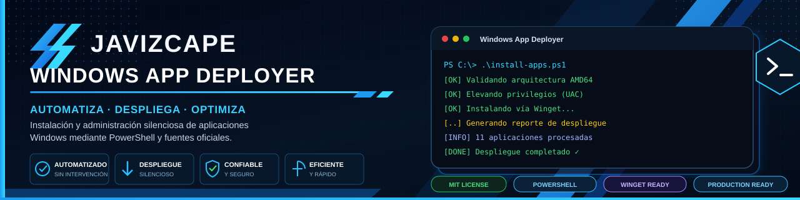
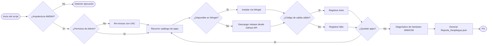

<div align="center">



<br>

<!-- Reemplaza "javizcape/windows-app-deployer" por la ruta real de tu repositorio -->
[](LICENSE)
[](#-requisitos)
[](#-ejecución-rápida)
[](#-cómo-funciona)

[](../../stargazers)
[](../../network/members)
[](../../commits/main)
[](../../issues)

**Un solo comando. Un equipo Windows completamente listo para producción.**

[Instalación rápida](#-ejecución-rápida) •
[Características](#-características-principales) •
[Software incluido](#-software-incluido) •
[Reporte JSON](#-reporte-de-telemetría) •
[Contribuir](#-contribuciones)

</div>

---

## 📌 Tabla de contenidos

- [¿Qué es WAD?](#-qué-es-wad)
- [Ejecución rápida](#-ejecución-rápida)
- [Requisitos](#-requisitos)
- [Características principales](#-características-principales)
- [Cómo funciona](#-cómo-funciona)
- [Software incluido](#-software-incluido)
- [Reporte de telemetría](#-reporte-de-telemetría)
- [Personalización](#-personalización)
- [Preguntas frecuentes](#-preguntas-frecuentes)
- [Hoja de ruta](#-hoja-de-ruta)
- [Contribuciones](#-contribuciones)
- [Licencia](#-licencia)
- [Autor](#-autor)

---

## 🧭 ¿Qué es WAD?

**Windows App Deployer (WAD)** es un script de código abierto en PowerShell que automatiza, en un solo comando, la puesta a punto completa de un equipo Windows x64: instala software esencial de forma silenciosa, valida cada paso y entrega un reporte de diagnóstico en JSON con el estado del hardware y de la instalación.

Pensado para técnicos, administradores de sistemas e integradores que necesitan dejar decenas de equipos configurados de manera **rápida, repetible y auditable**, sin clics manuales ni instaladores sueltos.

| | |
|---|---|
| 🖱️ **Cero interacción** | Todo el flujo corre desapercibido, sin ventanas de instalación molestas |
| 🔐 **Auto-elevación UAC** | Detecta permisos insuficientes y se relanza como Administrador |
| 🧩 **Híbrido Winget + GitHub API** | Usa el repositorio oficial de Microsoft y cae a releases de GitHub cuando no hay paquete |
| 📊 **Telemetría real** | CPU, RAM, disco y temperatura vía WMI/CIM al finalizar |
| ♻️ **Idempotente** | Valida códigos de salida (`0`, `3010`) antes de continuar al siguiente paso |

---

## 🚀 Ejecución rápida

### Método 1 — PowerShell (recomendado)

1. Pulsa **Inicio**, escribe `PowerShell` y ábrelo (el script solicitará permisos de Administrador automáticamente si los necesita).
2. Copia, pega y presiona **Enter**:

**Windows 10 / 11 (x64):**
```powershell
irm https://javizcape.github.io/.ps1/install-apps.ps1 | iex
```

**Alternativa** si tu red, ISP o DNS bloquean el comando anterior:
```powershell
iex (curl.exe -s https://javizcape.github.io/.ps1/install-apps.ps1 | Out-String)
```

> 💡 **Tip:** ejecuta PowerShell **como Administrador** para evitar el paso extra de re-elevación.

---

## ✅ Requisitos

- Windows 10 o Windows 11, arquitectura **x64 (AMD64)**
- PowerShell 5.1 o superior (incluido por defecto en Windows)
- Conexión a internet activa
- Winget instalado (viene por defecto en builds modernas de Windows 10/11 vía App Installer)

---

## 🛠️ Características principales

| Característica | Descripción |
|---|---|
| 🔐 **Auto-elevación de privilegios (UAC)** | Detecta si el usuario estándar requiere permisos de administrador y re-invoca la sesión sin interrumpir el flujo |
| 🧱 **Filtro estricto de arquitectura** | Validación en tiempo real que garantiza ejecución exclusiva en entornos de 64 bits (`AMD64`) |
| 🔀 **Despliegue híbrido silencioso** | Prioriza instalación nativa vía **Winget**; recurre a extracción por **GitHub API** para apps sin instalador oficial empaquetado (ej. *FlyPhotos*, *AB Download Manager*) |
| 🧪 **Gestión de errores integrada** | Captura códigos de salida de Windows (`0`, `3010`, etc.) para validar cada instalación antes de continuar |
| 📄 **Reporte de auditoría** | Genera un JSON con hardware, rendimiento y estado final de cada aplicación |

---

## ⚙️ Cómo funciona



---

## 📦 Software incluido

El script automatiza la instalación de las siguientes herramientas esenciales, garantizando la descarga de la **última versión estable** de cada una:

<details open>
<summary><b>🧩 Requisitos de sistema</b></summary>

| Aplicación | Descripción |
|---|---|
| Visual C++ Redistributable 2015+ | Runtime requerido por la mayoría de software Win32 moderno |
| .NET Framework | Activación vía DISM sobre componentes nativos de Windows |
| Java JRE x64 | Entorno de ejecución Java de 64 bits |

</details>

<details>
<summary><b>🧰 Herramientas de sistema</b></summary>

| Aplicación | Descripción |
|---|---|
| 7-Zip | Compresor/descompresor universal |
| Bulk Crap Uninstaller | Desinstalación masiva y limpieza de residuos |

</details>

<details>
<summary><b>🎬 Ofimática y multimedia</b></summary>

| Aplicación | Descripción |
|---|---|
| SumatraPDF | Lector de PDF ligero y rápido |
| VLC Media Player | Reproductor multimedia universal |
| FlyPhotos | Visor de imágenes de alto rendimiento |

</details>

<details>
<summary><b>🌐 Navegadores web</b></summary>

| Aplicación | Descripción |
|---|---|
| Google Chrome | Navegador de propósito general |
| Mozilla Firefox | Navegador orientado a privacidad y extensiones |
| Mullvad Browser | Navegador enfocado en anonimato |
| Microsoft Edge | Navegador nativo de Windows |

</details>

<details>
<summary><b>🔌 Utilidades de red</b></summary>

| Aplicación | Descripción |
|---|---|
| WinRAR x64 | Gestor de archivos comprimidos |
| AB Download Manager | Gestor de descargas con soporte multi-hilo |

</details>

---

## 📊 Reporte de telemetría

Al finalizar, WAD genera `Reporte_Despliegue.json` en el **Escritorio**, con datos listos para auditoría del equipo:

```json
{
  "hardware": {
    "fabricante": "Dell Inc.",
    "modelo": "OptiPlex 7090",
    "procesador": "Intel Core i5-11500",
    "arquitectura": "x64"
  },
  "rendimiento": {
    "ram_total_gb": 16,
    "ram_uso_porcentaje": 42,
    "disco_c_total_gb": 476,
    "disco_c_uso_porcentaje": 61
  },
  "diagnostico_termico": {
    "cpu_temp_celsius": 48.5,
    "fuente": "WMI/CIM"
  },
  "auditoria_instalacion": [
    { "app": "Google Chrome", "estado": "Éxito", "tiempo_segundos": 14.2 },
    { "app": "VLC Media Player", "estado": "Éxito", "tiempo_segundos": 9.8 },
    { "app": "FlyPhotos", "estado": "Fallo", "tiempo_segundos": 3.1 }
  ]
}
```

Incluye:
- **Especificaciones de hardware:** fabricante, modelo, procesador y arquitectura
- **Métricas de rendimiento:** RAM y disco (capacidad total y % de uso)
- **Diagnóstico térmico:** temperatura de CPU vía sensores de la placa base (WMI/CIM)
- **Auditoría de instalación:** tiempo y estado (éxito/fallo) por aplicación

---

## 🧩 Personalización

¿Necesitas otro catálogo de apps para tus propios despliegues? Edita la sección de configuración del script y ajusta:

- El listado de IDs de **Winget** a instalar
- Las URLs de releases de **GitHub** para apps sin paquete oficial
- El nombre y la ruta de salida del reporte JSON

---

## ❓ Preguntas frecuentes

<details>
<summary><b>¿Por qué el comando falla en mi red corporativa?</b></summary>
<br>
Algunos proveedores o políticas de DNS bloquean <code>irm</code>. Usa el método alternativo con <code>curl.exe</code> incluido en la sección de instalación.
</details>

<details>
<summary><b>¿Funciona en Windows en arquitectura ARM64?</b></summary>
<br>
No. WAD valida explícitamente <code>AMD64</code> y detiene la ejecución en cualquier otra arquitectura.
</details>

<details>
<summary><b>¿Puedo ejecutarlo sin ser administrador?</b></summary>
<br>
Sí. El script detecta la falta de privilegios y se re-invoca a sí mismo solicitando elevación UAC.
</details>

---

## 🗺️ Hoja de ruta

- [ ] Modo silencioso configurable por parámetros de línea de comandos
- [ ] Catálogo de aplicaciones editable vía archivo `config.json` externo
- [ ] Soporte para ARM64
- [ ] Registro de logs en formato `.log` además del reporte JSON

---

## 🤝 Contribuciones

Las contribuciones son bienvenidas. Para colaborar:

1. Haz un **fork** del repositorio
2. Crea una rama (`git checkout -b feature/nueva-funcion`)
3. Confirma tus cambios (`git commit -m 'Agrega nueva función'`)
4. Sube la rama (`git push origin feature/nueva-funcion`)
5. Abre un **Pull Request**

¿Encontraste un error? Abre un [issue](../../issues) describiendo el problema y, si es posible, adjunta el `Reporte_Despliegue.json` generado.

---

## 📄 Licencia

Este proyecto es de código abierto y se distribuye bajo la licencia **MIT**. Eres libre de auditar el código fuente, modificarlo, redistribuirlo y adaptarlo a tus propios flujos de trabajo o necesidades de administración de sistemas. Consulta el archivo [LICENSE](LICENSE) para más detalles.

---

## 👤 Autor

**Javizcape** — JAVIZCAPE Soluciones Tecnológicas
Integración de infraestructura TI, AV, CCTV y redes en Melgar, Tolima, Colombia.

[](https://github.com/javizcape)

<div align="center">

⭐ Si este proyecto te resultó útil, considera darle una estrella en GitHub

</div>
